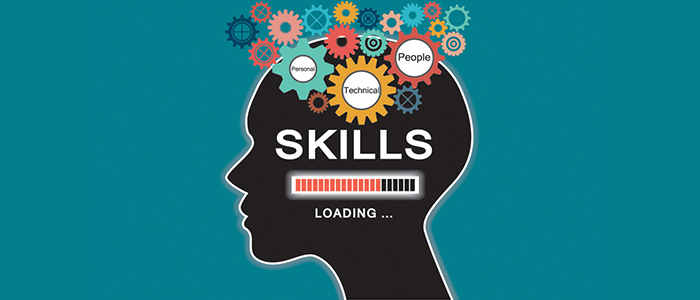

## About me

- :mortar_board: Research engineer in robotics and computer vision
- 🔭 Learning and Developing Machine Learning based projects in Python
- 🌱 Enthusiast in cyber Security and Artificial Intelligence
- 💬 Ask me anything about AI
- 📫 How to reach me: ankurvictor.mahtani@gmail.com

- 

<!--
PYTHON
C++
CUDA
GIT
HTML5
LATEX

 
<!--

 
<!--

<!--
# My Github status

<!--

--!>
