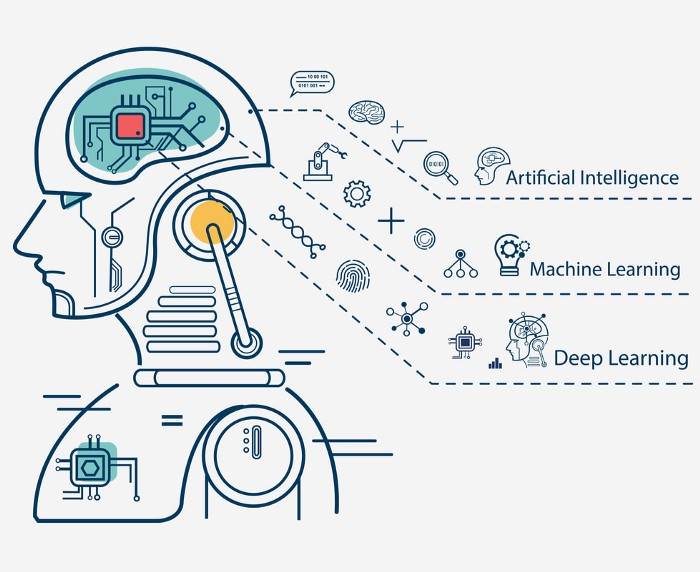

Welcome to my personnal GitHub :)

# About me

- :mortar_board: Research engineer in robotics and computer vision
- 🔭 Learning and Developing Machine Learning based projects in Python
- 🌱 Enthusiast in cyber Security and Artificial Intelligence
- 💬 Ask me anything about AI
- 📫 How to reach me: ankurvictor.mahtani@gmail.com

## Skills & interests

PYTHON
C++
CUDA
GIT
HTML5
LATEX
 

OPENCV
PCL
PYTORCH
TENSORFLOW
KERAS
 

GPU
ROS
SENSORS (cameras, fisheye cameras, thermal cameras, LiDAR, GNSS, IMU, radar)
SOLIDWORKS
 

# My Github status

  
  

